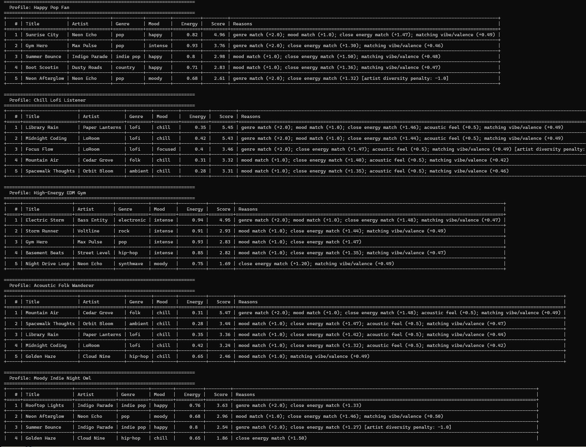

# Music AI Playlist Assistant

## Title and Summary
This project extends my original **Music Recommender Simulation** from Modules 1-3 into an applied AI system. The original project used a content-based scoring formula to rank songs from a small catalog based on structured user preferences such as genre, mood, energy, valence, and acousticness.

The new version adds a retrieval-based AI workflow. Instead of requiring a hand-filled profile, the system now accepts a free-form request, interprets it into preferences, retrieves relevant songs from the catalog, applies guardrails, and produces a grounded recommendation response based only on the retrieved evidence.

## Base Project and Original Scope
**Original project:** Music Recommender Simulation

**Original goal and capabilities:** The first version simulated how a streaming app might recommend songs using content-based filtering. It loaded songs from a CSV file, scored each song against a user profile, ranked the best matches, and explained why each recommendation was selected.

This repository now keeps that original ranking engine and extends it with a more rubric-aligned AI system layer on top.

## New AI Feature
The substantial new AI feature is a **retrieval-based assistant** integrated into the main application logic.

The assistant now:
- accepts a natural-language request such as "Give me chill acoustic music from the 2010s for studying"
- extracts structured preference signals from that request
- retrieves and re-ranks songs from the catalog
- generates a grounded recommendation response using only retrieved songs
- returns confidence and guardrail notes alongside the answer

This changes the system behavior in a meaningful way because retrieval and request interpretation now drive the output, rather than only a manually constructed user profile.

## Architecture Overview
The system has five main components:
- `CLI demo` in `src/phase1_demo.py`
- `Request parser and AI assistant` in `src/assistant.py`
- `Retriever/ranker` in `src/recommender.py`
- `Song catalog` in `data/songs.csv`
- `Tests and reliability checks` in `tests/`

## Architecture Diagram
```text
User Request
    |
    v
CLI Demo / App Entry Point
    |
    v
MusicAIAssistant.parse_request()
    |
    |-- extracts genre / mood / decade / energy / acoustic hints
    |-- computes confidence
    v
MusicAIAssistant._retrieve_candidates()
    |
    v
recommend_songs() in recommender.py
    |
    |-- scores every song in data/songs.csv
    |-- applies ranking + diversity logic
    v
Retrieved Song Candidates
    |
    |-- guardrail check verifies grounded output
    v
Grounded Recommendation Response
    |
    v
User sees recommendations, confidence, and guardrail notes

Tests / Human Review
    |
    |-- pytest checks parsing, retrieval, grounding, warnings
    |-- human reviews sample outputs in the demo
```

## Setup Instructions
### 1. Create a virtual environment
```bash
python -m venv .venv
```

### 2. Activate the environment
Windows:
```bash
.venv\Scripts\activate
```

Mac/Linux:
```bash
source .venv/bin/activate
```

### 3. Install dependencies
```bash
pip install -r requirements.txt
```

## How to Run the System
Run the original recommender demo:
```bash
python -m src.main
```

Run the new applied AI demo:
```bash
python -m src.phase1_demo
```

Run tests:
```bash
pytest -q
```

## Sample Interactions
### Example 1
**Input**
```text
I want happy pop for a morning commute with high energy.
```

**Output summary**
- Top recommendation: `Sunrise City` by `Neon Echo`
- Confidence: `0.70`
- Guardrail result: passed

### Example 2
**Input**
```text
Give me chill acoustic music from the 2010s for studying.
```

**Output summary**
- Top recommendation: `Library Rain` by `Paper Lanterns`
- Confidence: `0.85`
- Guardrail result: passed

### Example 3
**Input**
```text
I need intense workout music with high energy.
```

**Output summary**
- Top recommendation: `Storm Runner` by `Voltline`
- Confidence: `0.55`
- Guardrail result: passed

## Reliability, Evaluation, and Guardrails
The project includes:
- input validation for empty queries and invalid recommendation parameters
- confidence scoring based on extracted signals
- guardrail warnings for vague requests
- a guardrail check that verifies important request constraints in retrieved results
- automated tests for parsing, retrieval, grounding, and warning behavior

### Current testing summary
- `5/5` tests pass with `pytest -q`
- the demo runs end-to-end for three example requests
- guardrail output is visible in the demo for human review

## Reflection on AI Collaboration and System Design
I used AI during development for planning, debugging, and restructuring the project to match the applied-AI rubric more directly.

One helpful AI suggestion was to convert the original recommender into a retrieval-based assistant that accepts natural-language requests and produces grounded responses. One flawed AI suggestion was assuming the assignment’s wording about "phase 1" without checking the updated instruction file carefully enough.

## Limitations, Risks, and Future Improvements
- The catalog is small, so recommendation quality is limited by sparse data.
- The parser is keyword-based and can miss nuance.
- The confidence score is heuristic rather than learned.
- A future version could add embeddings, multi-source retrieval, and a larger evaluation harness.

---

# Music Recommender Simulation

## Project Summary

This project is a content-based music recommendation simulator built in Python.
Given a user's taste profile (preferred genre, mood, energy level, and whether they
like acoustic sounds), the system scores every song in a 20-song catalog and returns
the top matches — along with a plain-language explanation for each pick.

The project mirrors how real streaming platforms like Spotify decide what to play
next, but at classroom scale so every decision can be inspected and understood.

---

## How The System Works

### Real-world recommenders (context)

Platforms like Spotify and YouTube use two main strategies:

- **Collaborative filtering** — "people who liked what you like also liked *X*."
  It mines patterns across millions of users without caring what the songs actually
  sound like.
- **Content-based filtering** — matches a song's audio features (tempo, energy,
  valence, genre) directly to what you have shown you prefer.

This simulator uses **content-based filtering** exclusively because it is
transparent and works without needing a crowd of other users.

### Algorithm Recipe

| Feature | Weight (standard mode) | How it's scored |
|---|---|---|
| Genre match | +2.0 | Binary: exact string match |
| Mood match | +1.0 | Binary: exact string match |
| Energy similarity | 0-1.5 | `(1 - |song_energy - target|) * 1.5` |
| Acousticness bonus | +0.5 | Only if user `likes_acoustic` AND song acousticness > 0.6 |
| Valence similarity | 0-0.5 | `(1 - |song_valence - target|) * 0.5` |

Maximum possible score in standard mode: **5.5 points**

Songs are then ranked highest-to-lowest.  An optional **artist-diversity penalty**
subtracts 1.0 from each additional appearance of the same artist so no single
artist dominates the list.

### Four Ranking Modes (stretch feature)

| Mode | Genre wt | Mood wt | Energy wt |
|---|---|---|---|
| `standard` | 2.0 | 1.0 | 1.5 |
| `genre_first` | 4.0 | 0.5 | 0.5 |
| `mood_first` | 1.0 | 3.0 | 0.5 |
| `energy_first` | 0.5 | 0.5 | 3.0 |

### Song features used

`genre`, `mood`, `energy`, `valence`, `danceability`, `acousticness`,
`tempo_bpm`, `popularity`, `release_decade`, `instrumentalness`,
`speechiness`, `liveness`

### UserProfile fields

`favorite_genre`, `favorite_mood`, `target_energy`, `likes_acoustic`,
`target_valence`, `preferred_decade`

---

## Getting Started

### Setup

```bash
python -m venv .venv
# Mac/Linux:
source .venv/bin/activate
# Windows:
.venv\Scripts\activate

pip install -r requirements.txt
```

### Run the recommender

```bash
python -m src.main
```

### Run tests

```bash
pytest
```

---

## Terminal Output Screenshots



### Profile 1 — Happy Pop Fan

**Comment:** Sunrise City is the clear winner — it matches genre, mood, AND energy.
Gym Hero ranks 2nd because it matches genre and energy, but misses on mood (intense vs happy).
The diversity penalty knocks Neon Afterglow (also by Neon Echo) down from #3 to #5.

### Profile 2 — Chill Lofi Listener

**Comment:** Both lofi songs (Library Rain and Midnight Coding) score almost identically
because they are near-perfect matches. The system correctly catches Mountain Air and
Spacewalk Thoughts as secondary chill/acoustic alternatives even though they are different
genres, showing that the energy+acoustic features provide genre diversity.

### Profile 3 — High-Energy EDM Gym

**Comment:** The EDM profile correctly surfaces Electric Storm at #1 (genre + mood + energy
triple match). Ranks 2 and 3 miss genre but nail mood and energy. This shows the genre
weight pulls Electric Storm far ahead of similarly energetic songs.

### Profile 4 — Acoustic Folk Wanderer

**Comment:** Mountain Air is the obvious winner (the only folk song). Positions 2-5 are all
correctly low-energy and acoustic, even though they span different genres. This profile
demonstrates that the acoustic weight successfully crosses genre boundaries.

### Profile 5 — Moody Indie Night Owl

**Comment:** Interesting behavior here — Rooftop Lights wins on genre match even though its
mood (happy) is the opposite of what the user wants (moody). The system cannot tell that a
"happy indie pop" song would feel wrong for someone wanting "moody indie pop." This is a
clear weakness: mood mismatch does not penalize; it just fails to add points.

---

## Experiments You Tried

### Experiment 1 — Standard vs Energy-First mode for Happy Pop Fan

**Question:** What happens when energy similarity is worth 3× as much as genre?

**Result:** In `standard` mode, genre dominates — three pop songs fill the top 3.
In `energy_first` mode, genre and mood weights shrink to 0.5 each, so Summer Bounce
(indie pop, happy, energy=0.80) jumps to #2 ahead of Gym Hero, and country song
Boot Scootin enters the top 4. The list becomes more genre-diverse when energy is
the primary signal.

**Takeaway:** Genre is the strongest default predictor because it is worth 2 points for
a binary match. Reducing its weight immediately diversifies results.

### Experiment 2 — Artist Diversity Penalty

Turned off diversity (`diversity=False`) for the Happy Pop Fan profile.
Without the penalty, Neon Echo occupies both #1 (Sunrise City) and #3 (Neon Afterglow),
creating a mini filter bubble around a single artist.
With the penalty enabled, Neon Afterglow drops from #3 to #5, letting Summer Bounce
and Boot Scootin appear — a more varied listening experience.

### Experiment 3 — Chill Lofi vs Acoustic Folk

Both profiles prefer low-energy, acoustic music, but the lofi profile gets exclusively
lofi/ambient songs while the folk profile correctly leads with Mountain Air.
This shows the genre weight (2.0) is the decisive differentiator between two otherwise
similar taste profiles.

---

## Limitations and Risks

- **Small catalog** — 20 songs is not enough to provide real variety; several profiles
  hit the same 5 songs from different angles.
- **No lyric or language awareness** — two songs can sound identical to the algorithm
  even if one is in English and one in Mandarin.
- **Pop over-representation** — 4 of 20 songs are pop, so pop fans get many near-matches
  while niche genres (classical, country) have only 1 song each.
- **Binary genre/mood matching** — "indie rock" and "rock" are treated as completely
  different even though they overlap heavily in real listener taste.
- **No listening history** — the system treats every session as a fresh start with no
  memory of what the user has already heard.

---

## Reflection

See [model_card.md](model_card.md) for a full model card and personal reflection.

Real recommenders feel magical because they combine content signals with millions of
behavioral data points from other listeners. This simulation shows that even a simple
scoring formula can produce reasonable results — and reveals exactly where judgment
calls (what to weight, how to handle ties, when to inject diversity) translate directly
into whose taste gets served well and whose gets ignored.
